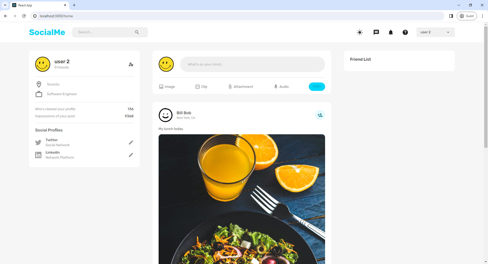
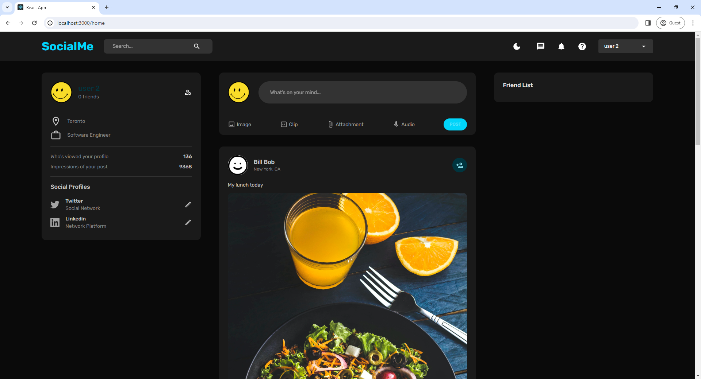
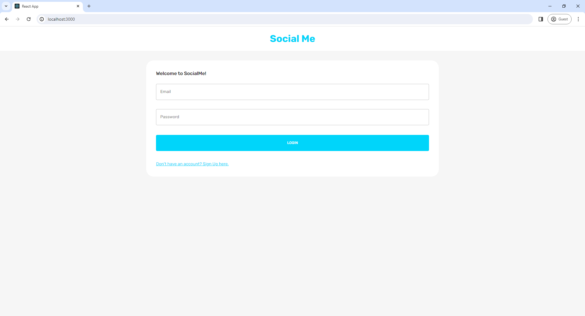
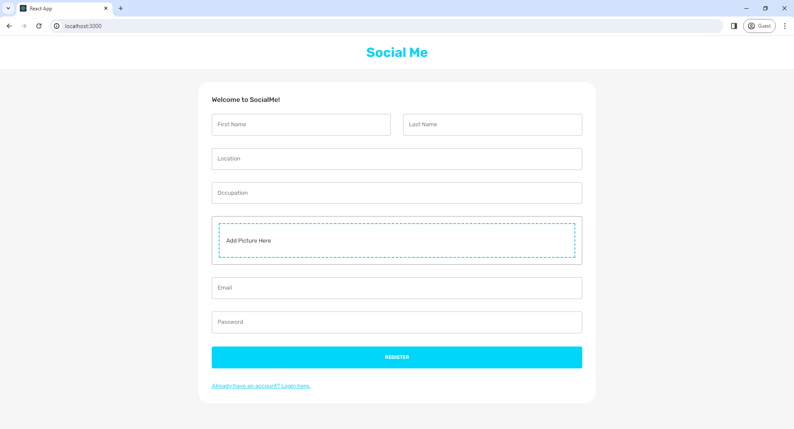
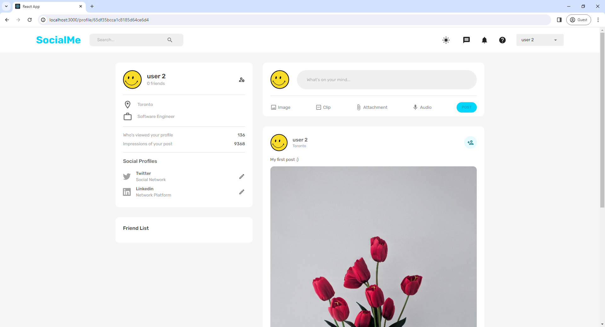

# SocialMe

SocialMe is a social media web application built with the MERN stack (MongoDB, Express.js, React.js, Node.js). The application includes key features commonly found on social media platforms, such as user profiles, posts, likes, and comments.

## Features

- User authentication (sign up, log in)
- User profiles
- Creating, editing, and deleting posts
- Liking and commenting on posts
- Dark mode

## Screenshots

### Home Page



### Dark Mode Home Page



### Log In Page



### Sign Up Page



### Profile Page



## Demo Video

Check out the demo video showcasing the main features of SocialMe: [Demo Video](demo/demo_video.mp4)

## Getting Started

To get a local copy up and running, follow these steps.

### Prerequisites

- Node.js
- MongoDB

### Installation

1. Clone the repository:

   ```bash
   git clone https://github.com/stefan-smol/socialme.git
   cd socialme
   ```

2. Install dependencies for both the client and server:

   ```bash
   cd client
   npm install
   cd ../server
   npm install
   ```

3. Create a `.env` file in the server directory and add your MongoDB URL and other environment variables:

   ```
   MONGO_URL=your_mongo_db_url
   JWT_SECRET=your_jwt_secret
   ```

4. Start the development server:
   ```bash
   cd ../client
   npm start
   cd ../server
   npm start
   ```
